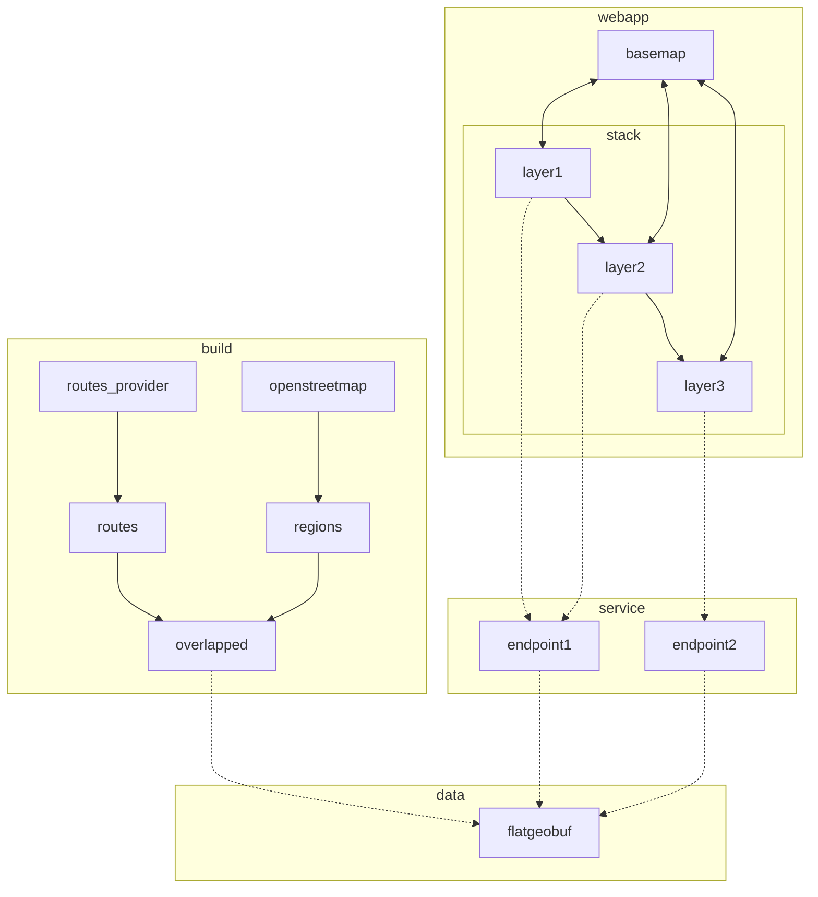

- (/) v0.1: show map bounding box as regions

  - (/) webapp

    - (/) get example sveltekit app working on netlify
      - (/) example sveltekit app working locally
      - (/) deployed on netlify; https://deploy-preview-8--spectrum-green.netlify.app
    - (/) show map, initially focussed on edinburgh
      - (/) switch to default setup for sveltekit
      - (/) add basic mapbox setup
      - (/) switch to centered on edinburgh
    - (/) call `regions` endpoint whenever bounding box changes
    - (/) maps returned geojson to regions displayed on the map, which is cleared whenever the bounding box changes
    - (/) hosted under spectrum.houseofmoran.io
      - (/) create domain name mapped to netlify
      - (/) configure netlify

  - (/) service
    - (/) create basic axum webapp, running on fly.io, showing "hello world"
      - (/) basic axum service running locally
      - (/) create fly.io `spectrum` app
      - (/) add tracing setup, sending traces to honeycomb
    - (/) `regions` endpoint that takes a bounding box and returns the bounding box as a polygon

- (x) v0.2: show openstreetmap regions
  - (x) build
    - (x) ingest openstreetmaps extract covering edinburgh
    - (x) find regions (incomplete, I think I don't know yet how to cover ways)
    - (x) save as flatgeobuf
  - (x) service
    - (x) find all polygons that are in the flatgeobuf within the bounding box and convert to geojson
  - (x) data
    - (x) just check in flatgeobuf file directly
- (x) ...
