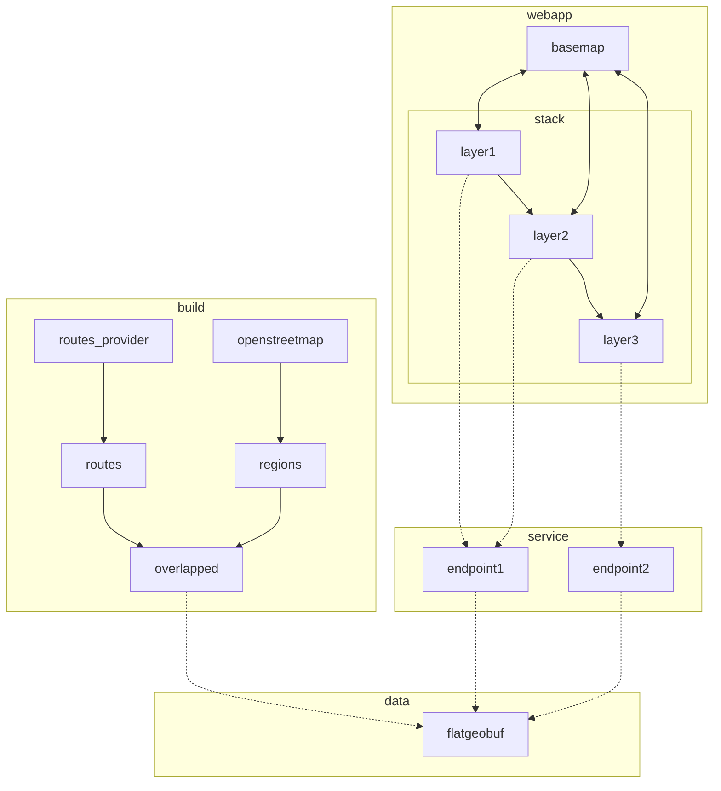

# green.houseofmoran.io

- [x] v0.1: show map bounding box as regions

  - [x] webapp

    - [x] get example sveltekit app working on netlify
      - [x] example sveltekit app working locally
      - [x] deployed on netlify; https://deploy-preview-8--spectrum-green.netlify.app
    - [x] show map, initially focussed on edinburgh
      - [x] switch to default setup for sveltekit
      - [x] add basic mapbox setup
      - [x] switch to centered on edinburgh
    - [x] call `regions` endpoint whenever bounding box changes
    - [x] maps returned geojson to regions displayed on the map, which is cleared whenever the bounding box changes
    - [x] hosted under spectrum.houseofmoran.io
      - [x] create domain name mapped to netlify
      - [x] configure netlify

  - [x] service
    - [x] create basic axum webapp, running on fly.io, showing "hello world"
      - [x] basic axum service running locally
      - [x] create fly.io `spectrum` app
      - [x] add tracing setup, sending traces to honeycomb
    - [x] `regions` endpoint that takes a bounding box and returns the bounding box as a polygon

- [x] v0.2: show openstreetmap regions
  - [x] build
    - [x] ingest openstreetmaps extract covering edinburgh
    - [x] find regions (incomplete, as I don't know yet how to handle relations)
    - [x] save as geojson and verify looks correct in geojson.io
    - [x] save as flatgeobuf
  - [x] data
    - [x] just check in flatgeobuf file directly
  - [x] service
    - [x] find all polygons that are in the flatgeobuf within the bounding box and convert to geojson
      - [x] locally
      - [x] on fly.io
- [x] v0.3: add basic search + cleanup pass
  - [x] add mapbox location search
  - [x] apply clippy hints
- [x] v0.4: collapse overlapping regions
  - [x] union regions (some of the regions found overlap)
  - [x] cleanups/tidy-ups
- [x] v0.5: path overlaps
  - [x] add /v1/overlaps endpoint and switch ui to use it; endpoint just works same way as regions
  - [x] simulate a route polygon with a rectangle
  - [x] follow this approach to find intersections and show them:
    1. put all region polygons in an rtree
    2. take polygon describing route and find intersection candidates using the rtree
    3. take only those candidates and union all them together
    4. intersect the route polygon with that unioned area
- [x] v0.6: add real routes

  - [x] select a couple of arbiratry points within the bb as start/end
  - [x] get a walking route from stadia maps
  - [x] show route
    - [x] find bounding rect of the route line
    - [x] find candidate intersections of that rect with green areas
    - [x] union those areas together
    - [x] find intersections between that union and the route line
    - [x] show all, in different layers
      - [x] show route in black
      - [x] show overlapping segments in green
  - [x] refactor / remove unneeded code / dependencies

- [ ] v0.7: focus on coverage
  - [x] visualise green areas as a light green layer
  - [x] minimally support OSM Relations, to increase what I get from existing areas
    - [x] map the outer Way of a Relation to a Polygon
  - [x] optimise builder (it is taking a while consuming Germany)
  - [x] expand to all of:
    - [x] Scotland
    - [x] Germany
    - [x] Japan
    - [x] South Korea
  - [ ] files are too big to be in a Docker container (3G+) so make flatgeobufiles remotely hostable
    - [x] upload fgb file to a CDN which supports Range requests
    - [x] extend api to use a remote URL
    - [x] fix performance problems: a relatively small file (https://spikes-remote-fgb.b-cdn.net/relations2.fgb, 149M) takes 3 minutes to fetch all geoms from for Edinburgh; this is surprising. Ideas for improving this:
      - [x] add tracing to used libraries (flatgeobuf, http_range_client) to see where in the time in this 3 mins is being spent
        - used `tracing-log` to propagate logs used by third-party crates into traces, which can then be enabled via `RUST_LOG=api=debug,api::flatgeobuf=trace,flatgeobuf=trace`
      - [ ] experiment: upload biggest file (relations5.fgb, 3.0G) and see if the latency scales with the total size (if so, that would indicate fgb is perhaps trying downloading the whole thing when it shouldn't)
      - [x] install a proxy (e.g. Proxyman) and look at what requests it is making
        - done: unexpectedly, for Edinburgh, it _is_ making range requests, but a lot of them. It's making about 6000+ separate GET's. Is it a coincidence that the number of polygons is about 6000? Is it making a separate request for each polygon?
      - [x] narrow geoms needed for route display: geoms needed for intersection with the route can come from the restricted bbox of the route and not Edinburgh as a whole
        - this now leads to only about six requests being made, to fetch 290 polygons, which is way better
      - [-] experiment: switch to a different CDN provider than bunny.net that also supports range requests
        - aborted this as it looks like range requests are going through fine (from looking at Proxyman)
      - [x] time to load is now about 1s (in total) for `/v2/route` but still minutes for `/v2/regions` so, disable loading/displaying the latter and just rely on mapbox base map for context of green areas
- [ ] vN: more deep support of relations
  - [ ] add commandline param to only add Ways directly or via Relations (just to more easily see where coverage comes from)
  - [ ] support mapping Relations like Princes Street Gardens (https://www.openstreetmap.org/relation/963806#map=17/55.94966/-3.20065) which seem to contain multiple outer Ways; I think because these Ways are part of multiple Relations e.g.https://www.openstreetmap.org/way/290611951#map=18/55.94956/-3.20217
  - [ ] support mapping Relations with holes
- [ ] vN: focus on only allowing navigation to supported areas
  - [ ] derive and save borders of areas imported as a separate flatgeobuf layer
    - perhaps use convex hull
  - [ ] show border of current area
  - [ ] restrict search to only allow navigating to places that are within an area covered
    - from looking at https://docs.mapbox.com/mapbox-search-js/api/web/search/#mapboxsearchbox#options I can't post-filter within the widget. However, it looks like, based on https://docs.mapbox.com/mapbox-search-js/api/core/search/#searchboxcore#suggest and related, I can use suggest then retrieve to get the geojson points and post-filter them. However, that probably means I need to write my own widget.
    - idea: do this server-side + client-side:
      - server-side uses fgf of areas to create an rtree
      - send rtree to client-side
      - use wasm-compiled rust or js-compatible lib to do client-side rtree-based filtering
- [ ] specialise to green.houseofmoran.io
  - [ ] switch netlify to be able to deploy multiple front-ends (green.houseofmoran.io and spectrum.houseofmoran.io)
  - [ ] switch fly.io to deploy to geo.houseofmoran.io
  - [ ] move current api to be under geo.houseofmoran.io/green/v1
- [ ] allow route parts nearby greenery to be highlighted, and not just those that go through greenery

  - [ ] for each route returned:
    - find minimal bounding rect of the route line
    - find candidate intersections of that rect with green areas
    - union those areas together
    - [ ] buffer that union
      - [ ] the `buffer_multi_polygon` from `geo_buffer` seems either slow or unstable (or at least, triggering floating-point instability in `geo`). it also is apparently currently based on an older version of geo which has known bugs; https://github.com/1011-git/geo-buffer/issues/1, https://github.com/1011-git/geo-buffer/issues/4. so, do a version of this that is based on `cavalier_contours` instead.
    - [ ] find intersections between that buffered union and the route line
    - [ ] show all

- [ ] ...

alternative idea for avoiding having to pre-union everything:

- this should be way less than all possible

4. intersect the route with that newly unioned shape

ideas for generating greener routes:

- dynamic perturbation:
  - use a routing library to find walking/bicycle routes between two points and then:
  - take the route, intersect with green areas, and then either:
    - mark empty (no green) sections as blocked
    - or, map green proportions to the cost of a section
  - ask routing library for a better route based on above score
  - iterate above, returning best found within x-millis
- pre-generation + dynamic matching:
  - take an area, subdivide, and find all walking/bicycle routes between centroids of areas
  - score all routes by proportion of greenery
  - dynamically:
    - map from/to points to closest centroids
    - lookup centroid1 to centroid2 route
    - patch a route from->centroid1, centroid2->to, and assemble into a route as from->centroid1->centroid2->to
- - green field (applies to all of above):
  * build a heatmap for areas by:
    - assigning a score to a block based on proportion of block which contains green (size of intersection)
    - or, assigning a score by a flood-filling regions (treating green areas as a fluid which is allowed to expand)
  * score route sections by overlap with field

# spectrum.houseofmoran.io
