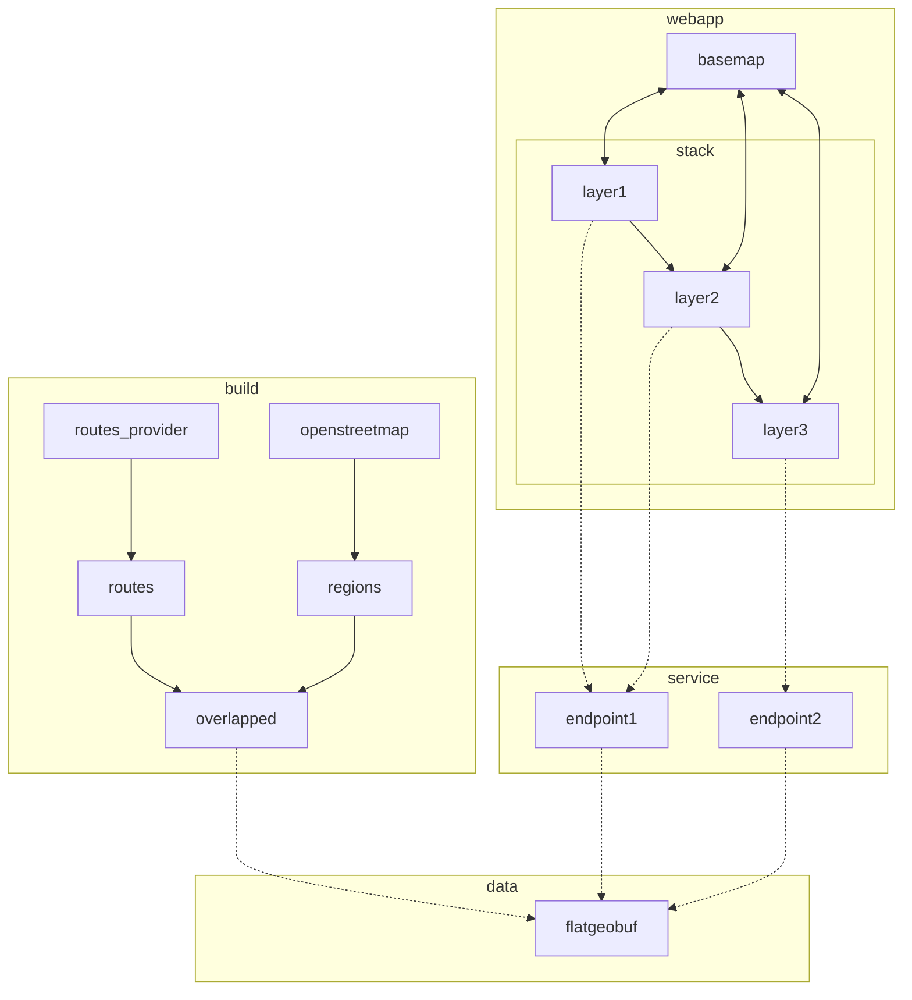

- (x) v0.1
  - (x) webapp
    - (x) show map, initially focussed on edinburgh
    - (x) call `routes` endpoint whenever boundbox box changes
    - (x) maps returned geojson to a route displayed on the map, which is cleared whenever the bounding box changes
  - (x) service
    - (x) `routes` endpoint that takes a bounding box and returns a random set of routes that overlap that bounding box, represented as geojson
  - build: none
  - data: none
- (x) ...
