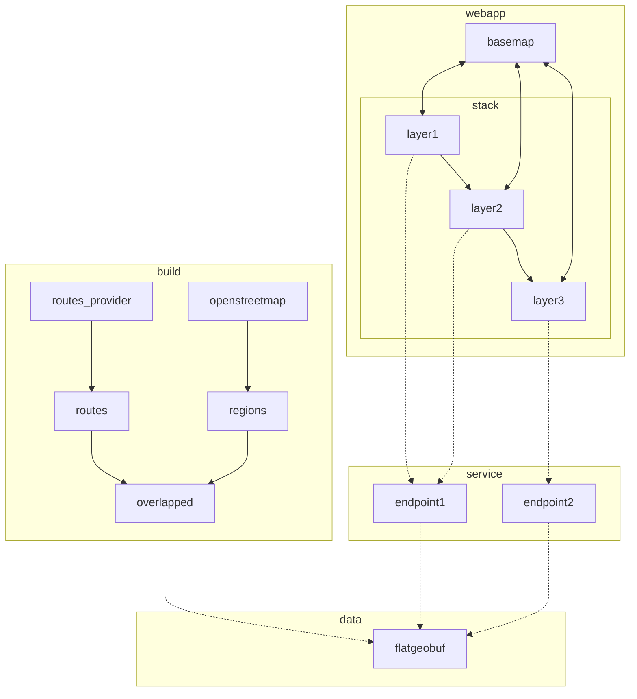

# green.houseofmoran.io

- [x] v0.1: show map bounding box as regions

  - [x] webapp

    - [x] get example sveltekit app working on netlify
      - [x] example sveltekit app working locally
      - [x] deployed on netlify; https://deploy-preview-8--spectrum-green.netlify.app
    - [x] show map, initially focussed on edinburgh
      - [x] switch to default setup for sveltekit
      - [x] add basic mapbox setup
      - [x] switch to centered on edinburgh
    - [x] call `regions` endpoint whenever bounding box changes
    - [x] maps returned geojson to regions displayed on the map, which is cleared whenever the bounding box changes
    - [x] hosted under spectrum.houseofmoran.io
      - [x] create domain name mapped to netlify
      - [x] configure netlify

  - [x] service
    - [x] create basic axum webapp, running on fly.io, showing "hello world"
      - [x] basic axum service running locally
      - [x] create fly.io `spectrum` app
      - [x] add tracing setup, sending traces to honeycomb
    - [x] `regions` endpoint that takes a bounding box and returns the bounding box as a polygon

- [x] v0.2: show openstreetmap regions
  - [x] build
    - [x] ingest openstreetmaps extract covering edinburgh
    - [x] find regions (incomplete, as I don't know yet how to handle relations)
    - [x] save as geojson and verify looks correct in geojson.io
    - [x] save as flatgeobuf
  - [x] data
    - [x] just check in flatgeobuf file directly
  - [x] service
    - [x] find all polygons that are in the flatgeobuf within the bounding box and convert to geojson
      - [x] locally
      - [x] on fly.io
- [x] v0.3: add basic search + cleanup pass
  - [x] add mapbox location search
  - [x] apply clippy hints
- [ ] v0.4: collapse overlapping regions
  - [x] union regions (some of the regions found overlap)
  - [ ] move union so that it happen at build time
  - [ ] cleanups/tidy-ups
- [ ] v0.5: specialise to green.houseofmoran.io
  - [ ] switch netlify to be able to deploy multiple front-ends (green.houseofmoran.io and spectrum.houseofmoran.io)
  - [ ] switch fly.io to deploy to geo.houseofmoran.io
  - [ ] move current api to be under geo.houseofmoran.io/green/v1
- [ ] v0.6: path overlaps
  - [ ] create a few arbitrary fixed paths across regions and show intersections
  - [ ] ...
- [ ] ...
- [ ] support relations

ideas for generating greener routes:

- dynamic perturbation:
  - use a routing library to find walking/bicycle routes between two points and then:
  - take the route, intersect with green areas, and then either:
    - mark empty (no green) sections as blocked
    - or, map green proportions to the cost of a section
  - ask routing library for a better route based on above score
  - iterate above, returning best found within x-millis
- pre-generation + dynamic matching:
  - take an area, subdivide, and find all walking/bicycle routes between centroids of areas
  - score all routes by proportion of greenery
  - dynamically:
    - map from/to points to closest centroids
    - lookup centroid1 to centroid2 route
    - patch a route from->centroid1, centroid2->to, and assemble into a route as from->centroid1->centroid2->to
- - green field (applies to all of above):
  * build a heatmap for areas by:
    - assigning a score to a block based on proportion of block which contains green (size of intersection)
    - or, assigning a score by a flood-filling regions (treating green areas as a fluid which is allowed to expand)
  * score route sections by overlap with field

# spectrum.houseofmoran.io
