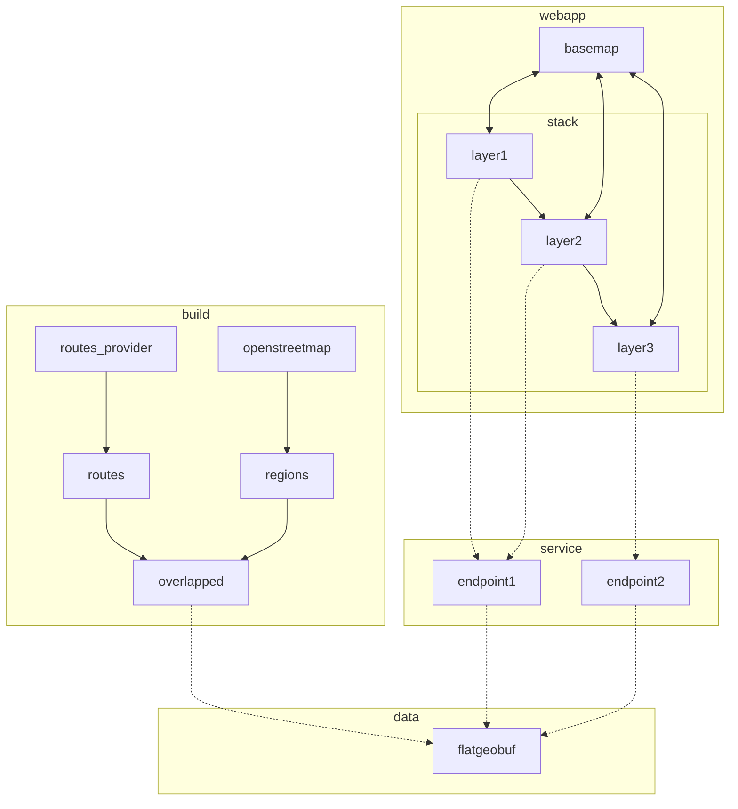

- (x) v0.1: show regions
  - (x) webapp
    - (x) get example sveltekit app working on spectrum.houseofmoran.io
      - (x) example sveltekit app working locally
      - (x) deployed on netlify
      - (x) hosted under spectrum.houseofmoran.io
    - (x) show map, initially focussed on edinburgh
    - (x) call `regions` endpoint whenever boundbox box changes
    - (x) maps returned geojson to regions displayed on the map, which is cleared whenever the bounding box changes
  - (x) build
    - (x) ingest openstreetmaps extract covering edinburgh
    - (x) find regions (incomplete, I think I don't know yet how to cover ways)
    - (x) save as flatgeobuf
  - (x) data
    - (x) just check in flatgeobuf file directly
  - (x) service
    - (x) `regions` endpoint that:
      - takes a bounding box
      - finds the shapes in the flatgeobuf that are in that bb
      - converts to geojson and returns it
- (x) ...
