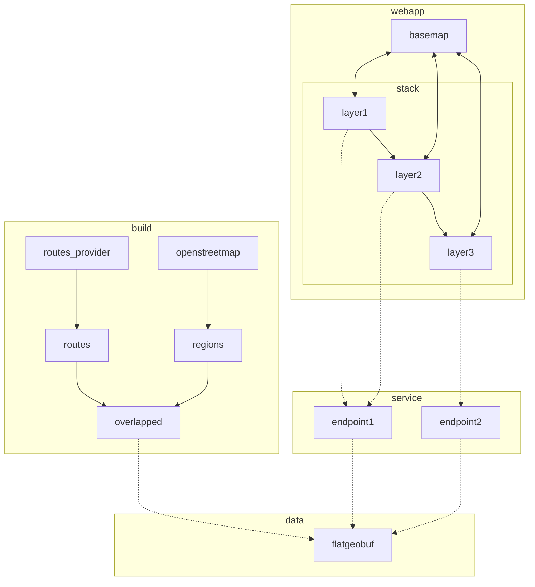

- [x] v0.1: show map bounding box as regions

  - [x] webapp

    - [x] get example sveltekit app working on netlify
      - [x] example sveltekit app working locally
      - [x] deployed on netlify; https://deploy-preview-8--spectrum-green.netlify.app
    - [x] show map, initially focussed on edinburgh
      - [x] switch to default setup for sveltekit
      - [x] add basic mapbox setup
      - [x] switch to centered on edinburgh
    - [x] call `regions` endpoint whenever bounding box changes
    - [x] maps returned geojson to regions displayed on the map, which is cleared whenever the bounding box changes
    - [x] hosted under spectrum.houseofmoran.io
      - [x] create domain name mapped to netlify
      - [x] configure netlify

  - [x] service
    - [x] create basic axum webapp, running on fly.io, showing "hello world"
      - [x] basic axum service running locally
      - [x] create fly.io `spectrum` app
      - [x] add tracing setup, sending traces to honeycomb
    - [x] `regions` endpoint that takes a bounding box and returns the bounding box as a polygon

- [x] v0.2: show openstreetmap regions
  - [x] build
    - [x] ingest openstreetmaps extract covering edinburgh
    - [x] find regions (incomplete, as I don't know yet how to handle relations)
    - [x] save as geojson and verify looks correct in geojson.io
    - [x] save as flatgeobuf
  - [x] data
    - [x] just check in flatgeobuf file directly
  - [x] service
    - [x] find all polygons that are in the flatgeobuf within the bounding box and convert to geojson
      - [x] locally
      - [x] on fly.io
- [x] v0.3: add basic search + cleanup pass
  - [x] add mapbox location search
  - [x] apply clippy hints
- [ ] v0.4: simple overlaps with fixed routes
  - [ ] union regions (some of the regions found overlap)
  - [ ] create a few arbitrary fixed paths across regions and show intersections
- [ ] ...
- [ ] support relations
